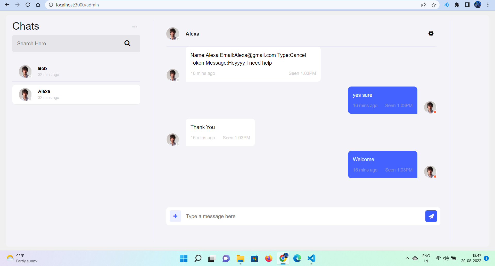
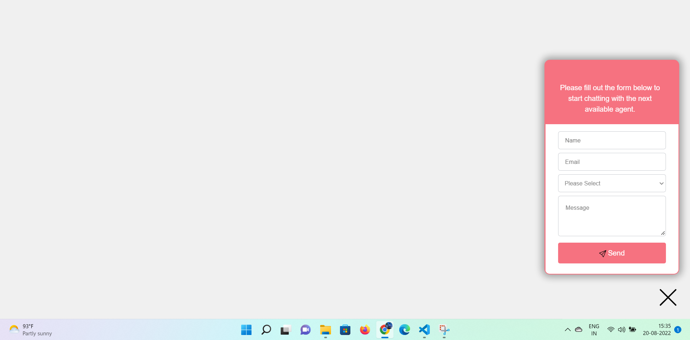
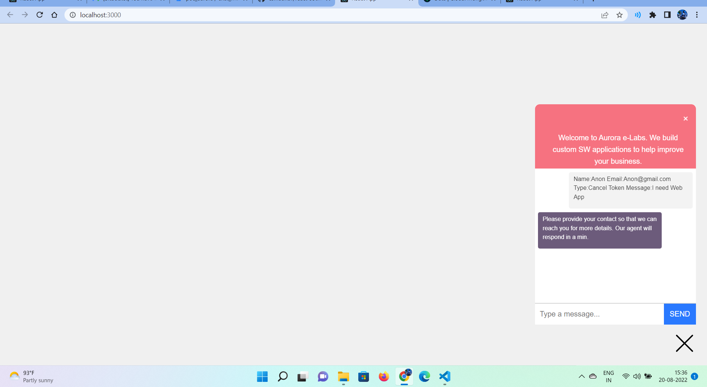

# CHAT MESSENGER

# clone the project start the servers separately

# chat_messenger Client Side

Here , we run the front end code. In this we have two routes 1.default(user) 2./admin 

In admin page admin can give the reply to all users at a time saperatly.

Demo Of Admin Dashboard

Demo Page Of User Details Form

Demo Page Of User Chat Page

# Backend

Install The Required Modules by entering npm install

### Move through all the above mentioned directories and run the following commands:

### npm install `or` npm i

To install the dependencies use the above command.

### npm start

To start the server we use the above command.

